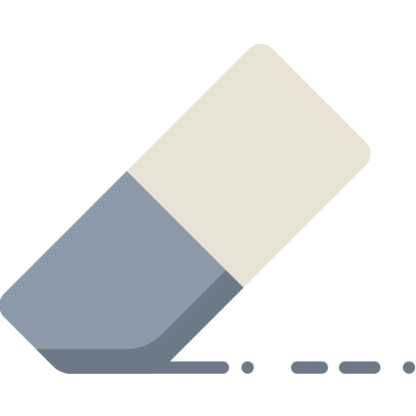

### KiamFormation
|  | "Помнишь, я тебе говорила про мусор, который стоит? Стоит и смердит? Так вот — это была метафора. Я имела в виду тебя." |
|---------------------------------------------------------------------------|-------------------------------------------------------------------------------------------------------------------------|
| 1) При запуске                                                            | Прямой запуск модуля `interface` (интерфейс PyQt5)                                                                      |
| 2) При импорте                                                            | Импорт всех подмодулей кроме `interface`                                                                                |

Пакет `kiam-formation` предназначен для численного моделирования навигации централизованного группового полёта космических аппаратов (КА). Навигация основана на RSSI.

#### <u>1. Запуск модуля</u>
``` console
python3 kiamformation
```
В открытом окне доступны настройка параметров и запуск численного моделирования.

| Иконка                                                     | Функция                                    | Описание                                                                                                                                                                  |
|------------------------------------------------------------|--------------------------------------------|---------------------------------------------------------------------------------------------------------------------------------------------------------------------------|
|     | `static.cosmetic.talk()`                   | Случайная фраза.                                                                                                                                                          |
|   | `interface.main_run()`                     | Запуск/продолжение численного моделирования (с отображением `visualization.plot_distance()`)                                                                                    |
|       | `visualization.plot_distance()`            | 2D-отрисовка результатов численного моделирования (ошибки навигации, численные критерии наблюдаемости)                                                                    |
|      | `visualization.plot_all()`                 | 3D-отрисовка результатов численного моделирования в браузере по умолчанию. Пример отрисовки:                                    |
|      | `interface.plot_1_param()`                 | Ручная отрисовка записанных параметров из таблицы `physics.PhysicModel.record` (после выбора каждого параметра "ок", для отображения выбранных параметров "cancel")       |
|    | `visualization.plot_model_gain()`          | Отрисовка диаграмм направленностей для выбранных антенн материнских и дочерних КА (выбор модели в `spacecrafts.local_dipole`)                                             |
|        | `visualization.plot_atmosphere_models()`   | Отрисовка доступных моделей расчёта плотности атмосферы (выбор модели в `config.Variables.ATMOSPHERE_MODEL`)                                                              |
|  | `visualization.animate_reference_frames()` | Анимирование орбитального движения в `/localfiles/res.gif`. Нужна для валидации моделирования. Создаёт анимацию следующего вида:  |
|       | `interface.save_trajectories()`            | Сохраняет результаты численного моделирования в `/srs/kiamformation/data/trajectories`                                                                                    |
|       | `interface.load_trajectories()`            | Загружает результаты численного моделирования из `/srs/kiamformation/data/trajectories`                                                                                   |
|     | `interface.remove_trajectories()`          | Удаляет результаты численного моделирования в `/srs/kiamformation/data/trajectories`                                                                                      |


#### <u>2. Импорт модуля</u>
``` Python
import kiamformation as kf
o = kf.init()
```

Переменная `o` класса `config.Objects` - конфигурационный класс моделирования. Он содержит:
1. `a` - переменная класса `spacecrafts.Anchor(Apparatus)` (мнимый КА в центре ОСК)
2. `c` - переменная класса `spacecrafts.CubeSat(Apparatus)` (материнские КА одного типа)
3. `f` - переменная класса `spacecrafts.FemtoSat(Apparatus)` (дочерние КА одного типа)
4. `p` - переменная класса `physics.PhysicModel` с функциями численного моделирования
5. Параметры численного моделирования, 

Автор пакета использует импорт модуля в целях символьного анализа проблемы навигации. Для этого следует задать параметры окружения и КА в символьном виде:
``` Python
import kiamformation as kf
o = kf.init(symbolic=True)
```

#### <u>3. Содержание репозитория</u>
1. kiamformation
   1. config - конфигурация численного моделирования (класс: Objects)
   2. controls - (пока что нет функционала)
   3. flexmath - специальный подмодуль для численного-символьного полиморфизма
   4. guidance - (пока что нет функционала)
   5. H_matrix - расчёт матрицы частных производных измерений по состоянию группы КА (генерируется автоматически)
   6. interface - интерфейс (при прямом запуске модуля)
   7. math_tools - математические функции
   8. measurements - функции расчёта измерений группы КА в целом; реализовано: {RSSI}
   9. navigation - определение орбитального (и углового) движения дочерних КА в группе (класс: KalmanFilter)
   10. physics - функции численного моделирования и динамики КА, перевода между СК (класс: PhysicModel)
   11. simulation - дополнительные функции (мало используется)
   12. spacecrafts - классы КА (классы: Apparatus, Anchor(Apparatus), CubeSat(Apparatus), FemtoSat(Apparatus))
   13. visualization - функции 2D и 3D отображения
2. notebooks
   1. analysis - ручная проверка верности написанных функций
   2. asteroid - экспресс-сборка информации по астероидам
   3. cheat sheet - вспомогательный файл по используемым сторонним модулям; примеры их использования
   4. control - вспомогательный файл по функциям управления
   5. dynamics - ручная проверка динамики, описанной в проекте
   6. H matrix generation - генерация файла H_matrix.py
   7. hardware - экспресс-сборка информации по экспериментам
   8. observability - общий анализ наблюдаемости группового полёта при различных его конфигурациях

#### <u>4. Особенности реализации</u>
1. Шаг по времени в фильтре Калмана и в моделировании одинаковый
2. Коэффициент усиления антенн рассчитывается от расстояния $\vec{r}_1-\vec{r}_2$. Правильнее было бы обозначить наоборот.
3. `physics.ode4()` возвращает 4-кватернион, только если он изначально обрабатывал np.quaternion
